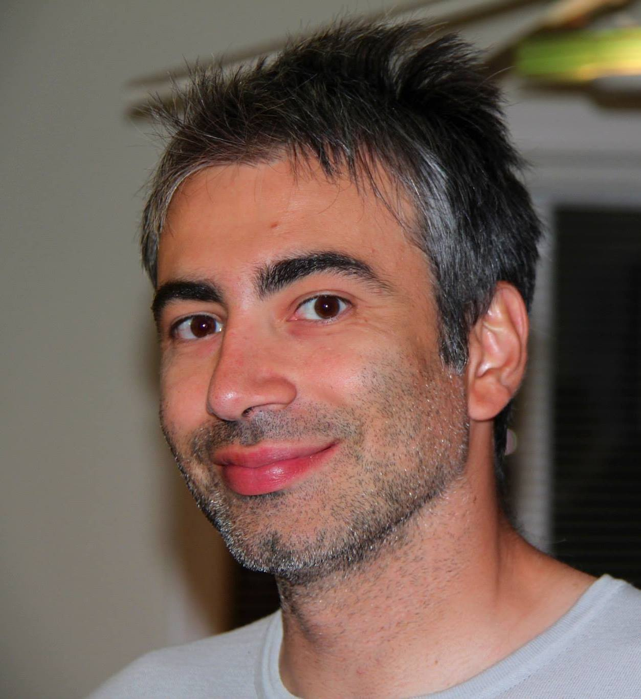

Christian Di Sanzo, Ph.D. Candidate
===================================

| `Email <cdisanzo@berkeley.edu>`_ 

Education
---------

* Ph.D. Nuclear Engineering, University of California, Berkeley, CA, 2014
* M.S. Mechanical Engineering, University of California, Los Angeles, CA, 2009
* M.S. Energy Engineering, University of Bologna, Italy, 2007
* B.S. Energy Engineering, University of Bologna, Italy, 2004

Publications
------------

- Cisneros, N. Zweibaum, C. Di Sanzo, Jeremie Cohen, E. Greenspan, P. Peterson, and B. Ludwigt Feasibility of once through subcritical cores driven by an accelerator spallation neutron source, Fusion Science and Technology, Volume 61-1T, January 2012 p. 431-435 

- Di Sanzo, M. Abdou, M. Youssef - Fusion-Fission Transuranic transmutation efficiency of a small fusion-fission facility for spent uranium-oxide and inert matrix fuels, Fusion Engineering and Design Vol.85, Issue 7-9, December 2010 

- Di Sanzo and E. Greenspan, A Search For Minimum Volume Of Breed And Burn Cores, Proceedings of the ICAPP '12, International Congress on Advances in Nuclear Power Plants, Chicago, IL, June 24-28, 2012, p. 1046-1053, American Nuclear Society(2012) 

- EPRI 1025086 - Technical Evaluation of the Hitachi Resource-Renewable BWR (RBWR) Design Concept. Electric Power Research Institute (2012) 

- DiSanzo, J. Vujic, M. Bandstra, D. H. Chivers, K. Vetter and T. Aucott The Fukushima Accidents: Simulation of the NPP Inventory and Comparison with Experimental Measurements of the Fallout by the UC Berkeley Team, Proceedings of GLOBAL 2011 Makuhari, Japan, Dec. 11-16, (2011)

- DiSanzo and J.Ahn, Effects of Burn-up, Recovery Efficiency and Waste Form on the Environmental Impact of Fusion-Fission Transmutation Systems, Proceedings of GLOBAL 2011 Makuhari, Japan, Dec. 11-16, (2011). 

- Di Sanzo and J. Ahn, Cradle-to-Grave Analysis of Fusion-Fission Transmutation Fuel Cycles, Proceedings os International High-Level Radioactive Waste Management Conference (IHLRWM), April 10-14, Albuquerque, New Mexico, American Nuclear Society, (2011). 

- Di Sanzo, J. Cohen, A. T. Cisneros, B. Ludewigt and E. Greenspan An Accelerator Driven Energy Multiplier for Doubling Uranium Ore Utilization, Proceedings of AccApp '11, Tenth International Topical Meeting on Nuclear Applications of Accelerators, Knoxville, TN April 3-7, 2011, 7 pp., American Nuclear Society. (2011) 

- Di Sanzo and J. Ahn, Environmental Impact Analysis for Fusion-Fission Transmutation Systems, Proceedings of International Exchange Meeting on Partitioning and Transmutation, 11th IEMPT, San Francisco, (2010) 

- Bergmann, T. Cisneros, C. DiSanzo, B. Frisbie, E. Greenspan, A Search for Optimal Blanket Design for the LIFE Fusion-Fission Reactor, INES 3, Tokyo (2010) 

- Landreman, B. Coppi, C.D. Di Sanzo, - Correlation between Accretion Theory and Toroidal Rotation Experiments (34thEuropean Physical Society Conference on Plasma Physics 2007)

- Di Sanzo, B. Coppi, M. Landreman, - Confinement Regime Transition: Spontaneous Rotation Reversal and Collisionality of the Plasma Edge (American Physical Society, 49th APS Meeting 2007)

Awards
------

- Jane Lewis fellowship, UC Berkeley
- Outstanding Mentorship award, UC Berkeley, Nuclear Enginering
- ANS Graduate Scholarship
